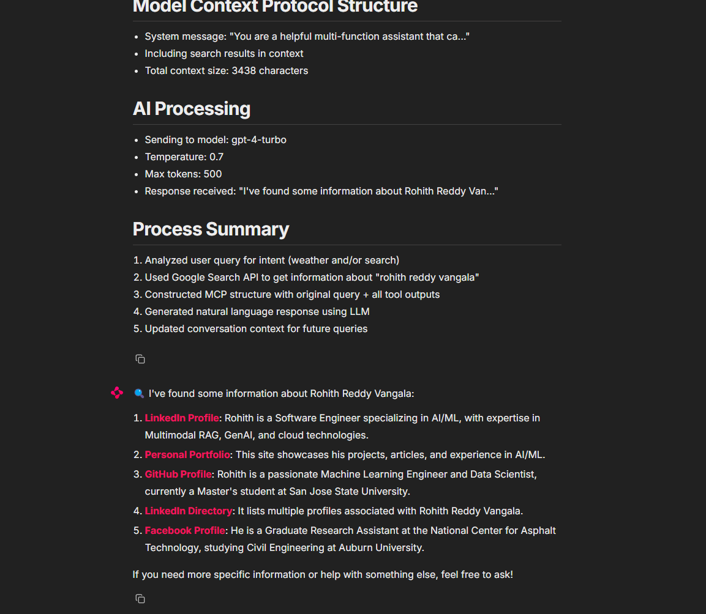

# Multi-Function Assistant

A Chainlit-powered chatbot that provides both weather information and web search capabilities in a single, intuitive interface.

## Features

- **Weather Information**: Get current weather conditions or forecasts for any location
- **Web Search**: Find information on any topic using Google Search integration
- **Combined Queries**: Ask for both weather and search results in a single question
- **Debug Mode**: View the assistant's reasoning process (optional)

## Demo



## Installation

### Prerequisites

- Python 3.8+
- API keys for:
  - OpenAI
  - WeatherAPI.com
  - RapidAPI (Google Search)

### Setup

1. Clone the repository:
   ```bash
   git clone https://github.com/yourusername/multi-function-assistant.git
   cd multi-function-assistant
   ```

2. Install the required dependencies:
   ```bash
   pip install -r requirements.txt
   ```

3. Create a `.env` file in the project root with your API keys:
   ```
   OPENAI_API_KEY=your_openai_api_key
   WEATHER_API_KEY=your_weatherapi_key
   RAPID_API_KEY=your_rapidapi_key
   ```

## Usage

Run the application with:

```bash
chainlit run app.py
```

Then open your browser and navigate to `http://localhost:8000` to interact with the assistant.

### Example Queries

- "What's the weather in Tokyo?"
- "Search for artificial intelligence news"
- "Tell me about the forecast in Paris and lookup tourist attractions there"

## Architecture

The application follows a Model Context Protocol (MCP) architecture:

1. **Input Analysis**: Parses user queries to identify intent (weather, search, or both)
2. **Tool Execution**: Calls the appropriate external APIs based on the identified intent
3. **Context Building**: Combines the original query with API responses
4. **Response Generation**: Uses OpenAI's GPT model to generate natural language responses
5. **Context Management**: Maintains conversation history for continuity

## Configuration

You can modify the following variables in `app.py`:

- `DEBUG_MODE`: Set to `True` to view the assistant's reasoning process, `False` to hide it
- Weather and Search API endpoints and parameters

## Dependencies

- `chainlit`: For the chat interface
- `openai`: For natural language processing
- `requests`: For API calls
- `python-dotenv`: For environment variable management

## License

[MIT License](LICENSE)

## Contributing

Contributions are welcome! Please feel free to submit a Pull Request.

1. Fork the repository
2. Create your feature branch (`git checkout -b feature/amazing-feature`)
3. Commit your changes (`git commit -m 'Add some amazing feature'`)
4. Push to the branch (`git push origin feature/amazing-feature`)
5. Open a Pull Request
